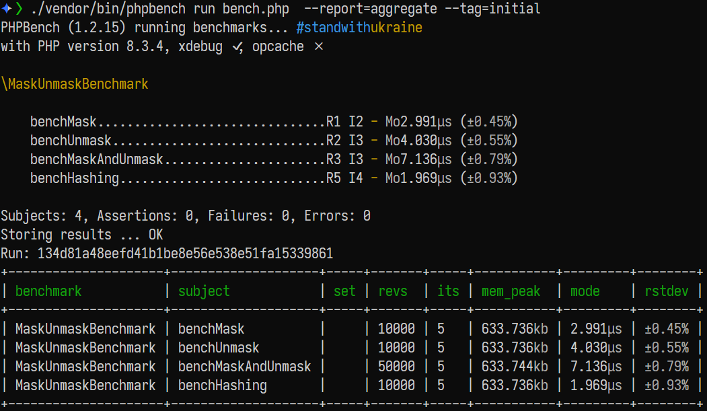

# PHP IDMask Mini

PHP IDMask Mini is a test project to determine the performance one might expect from using AES-128-ECB to obfuscate 64bit integers, typically database IDs etc. It's based on ideas from the Java [IDMask](https://github.com/patrickfav/id-mask) library and is not intended for actual use.

Only 8 byte integer value masking/unmasking is implemented.

## Features

PHP IDMask Mini obfuscates a 64-bit integer by producing a 128-bit AES block encoded in Base64url.

- **Masking**: The primary function of this code is to mask the value of the ID and keep it deterministic.
- **Validation**: Upon decryption, the first part of the code (which is a pre-agreed static 64bit value) is checked for consistency. It should NOT be regarded an authentication mechanism.

## Usage

```php
require("./main.php");

$key="7086e571d8dfb475f5c13afc0fceb1fe";
$ck=0xbaadf00d;

$testVector="_tUK-o3a4N713zdVj60yEQ";
$testValue=1234567901;

$masked = mask($key, $ck, $testValue);
printf("Masked:   %s\n", $masked);
printf("Expected: %s\n", $testVector);

$unmasked = unmask($key, $ck, $testVector);
printf("Unmasked: %s\n", $unmasked);
```

Output:

```shell
$ php test.php
Input:    1234567901
Masked:   _tUK-o3a4N713zdVj60yEQ
Expected: _tUK-o3a4N713zdVj60yEQ
Unmasked: 1234567901
```

In this test, the first part is a pre-agreed static 64bit value and the second part is the actual encrypted part.
When decrypted, you can check that the first part is correct and get some level of validation.

**Even after decryption, the value should be treated like regular unsanitized user input!**

## Performance



| Benchmark           | Subject            | Set | Revs  | Its | Mem Peak  | Mode    | Rstdev |
| ------------------- | ------------------ | --- | ----- | --- | --------- | ------- | ------ |
| MaskUnmaskBenchmark | benchMask          |     | 10000 | 5   | 633.736kb | 2.994μs | ±0.97% |
| MaskUnmaskBenchmark | benchUnmask        |     | 10000 | 5   | 633.736kb | 4.006μs | ±0.94% |
| MaskUnmaskBenchmark | benchMaskAndUnmask |     | 50000 | 5   | 633.744kb | 7.053μs | ±0.70% |
| MaskUnmaskBenchmark | benchHashing       |     | 10000 | 5   | 633.736kb | 1.991μs | ±1.07% |

`mask()` and `unmask()` are quite performant, only roughly 2x the speed of a simple HMAC-SHA-256 operation (`benchHashing`) and shouldn't cause issues unless called thousands of times per second.

## Running benchmarks

You can run benchmarks by running

```shell
./vendor/bin/phpbench run bench.php  --report=aggregate
```

It is possible to create baselines and compare to them. An initial baseline is included in the repo and you can compare runtimes to it by running

```shell
./vendor/bin/phpbench run bench.php  --report=aggregate --ref=initial
```

## Disclaimer

This test project is intended for evaluating the performance of ID value obfuscation by masking using encryption and is not a replacement for actual encryption.

## License

This project is licensed under the MIT License.
